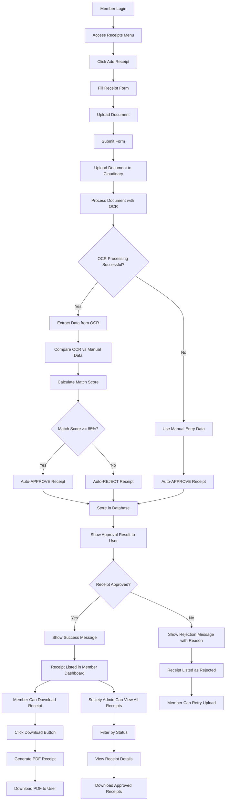

# Receipt Upload System Flow Diagram

## System Overview
This document describes the complete flow of the receipt upload system with OCR processing and automatic approval/rejection.

## Flow Diagram



## Detailed Process Flow

### 1. Member Receipt Upload Process

```
1. Member logs in and navigates to Receipts menu
2. Clicks "Add Receipt" button
3. Fills out the receipt form with:
   - Block Number
   - Flat Number  
   - Amount
   - Payment Date
   - Purpose (Maintenance, Water, Electricity, etc.)
   - Payment Method (Cash, UPI, Bank Transfer, Cheque)
   - Transaction ID (if bank transfer)
   - UPI ID (if UPI payment)
   - Document upload (image/PDF)
4. Submits the form
```

### 2. Backend Processing

```
1. Upload document to Cloudinary
2. Process document with Google Cloud Document AI OCR
3. Extract data from OCR:
   - Block Number
   - Flat Number
   - Amount
   - Payment Date
   - Purpose
4. Compare OCR data with manual entry
5. Calculate match score (0-100%)
6. Auto-approve if match score >= 85%
7. Auto-reject if match score < 85%
8. Store receipt in database with status
```

### 3. Receipt Generation (On-Demand)

```
1. Member clicks "Download Receipt" for approved receipts
2. System generates professional PDF receipt with:
   - Society header and details
   - Member information
   - Payment details
   - Receipt ID and date
   - Approval status
3. PDF is uploaded to Cloudinary
4. Download link is provided to user
```

### 4. Society Admin View

```
1. Society admin can view all receipts
2. Filter by status (Approved/Rejected)
3. Search by member name, block, flat, purpose
4. View receipt details and OCR confidence scores
5. Download approved receipts
```

## Key Features

### Automatic Approval System
- **OCR Match Score >= 85%**: Auto-approve
- **OCR Match Score < 85%**: Auto-reject
- **No OCR data**: Auto-approve (manual entry trusted)

### Receipt Generation
- Professional PDF format
- Society branding
- Member details
- Payment information
- Receipt ID and timestamp
- Generated only on download request

### Database Schema
```sql
Receipt {
  id: String
  memberId: String
  societyId: String
  blockNumber: String
  flatNumber: String
  amount: Float
  paymentDate: DateTime
  purpose: String
  paymentMethod: PaymentMethod
  transactionId: String?
  upiId: String?
  documentUrl: String
  documentName: String
  ocrData: Json?
  ocrConfidence: Float?
  ocrMatchScore: Float?
  isManualEntry: Boolean
  status: ReceiptStatus (APPROVED/REJECTED)
  autoApproved: Boolean
  generatedReceiptUrl: String?
  createdAt: DateTime
  updatedAt: DateTime
}
```

## API Endpoints

### Member Endpoints
- `GET /api/member/receipts` - Get member's receipts
- `POST /api/member/receipts` - Upload new receipt
- `GET /api/member/receipts/[id]/download` - Download receipt PDF

### Society Admin Endpoints
- `GET /api/society-admin/receipts` - Get all society receipts
- `GET /api/society-admin/receipts/[id]` - Get specific receipt

## Security Features
- Authentication required for all endpoints
- Role-based access control
- Document validation
- OCR confidence scoring
- Automatic fraud detection through match scoring

## Error Handling
- OCR processing failures
- Document upload failures
- Database errors
- Network timeouts
- Invalid file formats

## Performance Optimizations
- Async OCR processing
- Cloudinary CDN for document storage
- On-demand PDF generation
- Efficient database queries
- Caching of OCR results
